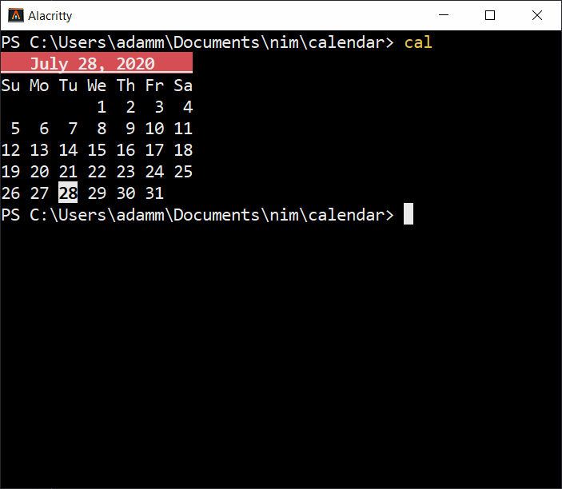

# calendar

A tiny calendar program written to help relearn nim-lang.



## Installation

Install with [nimble](https://github.com/nim-lang/nimble).
```bash
git clone https://github.com/adam-mcdaniel/calendar
cd calendar
nimble install; cal
```